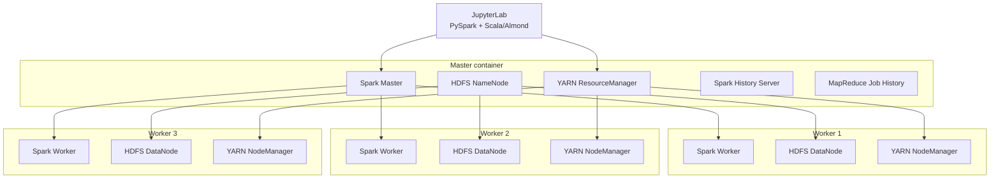

# Spark & Hadoop Research Lab

A **reproducible reference environment for Apache Spark experimentation and benchmarking**, running a multi-node Spark and Hadoop stack in Docker.

The lab provides **Spark Standalone, YARN, HDFS, JupyterLab, Spark History Server and MapReduce Job History Server** in a version-pinned environment, without requiring Spark, Hadoop or Java to be installed directly on the host.

It is designed for **research, learning, controlled experimentation and benchmark validation**. The default topology runs one master and three workers as separate containers, allowing you to execute distributed jobs, inspect scheduling and executor behavior, store datasets in HDFS, and revisit completed applications through execution-history services.

> **Scope.** All cluster services run on a single physical host. Processes and services are distributed across containers, but CPU, disk and network remain shared. The environment is appropriate for software validation, controlled experiments and reproducibility studies; conclusions about physical multi-host scalability, network behavior or hardware-level fault tolerance require a separate deployment.

## Why this project

Modern Spark experiments often require more than a local `pyspark` session: they need a reproducible execution environment, distributed storage, explicit resource limits, execution history and a way to compare configurations under controlled conditions.

This repository provides that reference environment with:

- **Two Spark execution managers:** Spark Standalone and YARN.
- **Distributed storage:** HDFS with one NameNode and three DataNodes.
- **Interactive development:** JupyterLab with PySpark and Scala/Almond kernels.
- **Execution observability:** Spark, YARN and HDFS web interfaces, Spark History Server and MapReduce Job History Server.
- **Controlled resources:** explicit CPU and memory limits for repeatable experiments.
- **Persistent state:** named Docker volumes for HDFS metadata, blocks and benchmark data.
- **Validation tooling:** smoke tests and notebook validation scripts for distributed execution.
- **Benchmark integration:** a dedicated path for validating the accompanying HiBench modernization on the same reference stack.

## Runtime

The software stack is intentionally version-pinned to provide a stable and reproducible reference environment.

| Component | Version |
| --- | --- |
| Apache Spark | **3.5.9**, official `bin-hadoop3` distribution |
| Apache Hadoop | **3.3.6** — HDFS, YARN and MapReduce |
| Java | **OpenJDK 11** |
| Python | **3.10**, with PySpark bundled with Spark |
| Scala | **2.12.18** |
| Almond | **0.14.1** |
| Container OS | **Ubuntu 22.04 LTS** |

## Architecture



Spark Standalone and YARN coexist on the same workers but use independent schedulers. For controlled comparisons, run experiments with **one execution manager at a time**.

## 🚀 Quick start

### Requirements

- Docker Desktop running **Linux containers** on Windows, or Docker on Linux.
- Docker Compose.
- PowerShell on Windows.
- A local checkout or extracted copy of this repository.
- Enough memory allocated to Docker: configured service limits total **26 GiB**, plus Nginx and Docker overhead.
- Free disk space for images, dependency caches and HDFS datasets.
- Internet access for the first build.

If you are migrating an existing cluster, read [`MIGRATION.md`](MIGRATION.md) first. Adding persistent volumes does not automatically migrate data from existing containers.

### Windows

Run from the repository root:

```powershell
.\scripts\build_images.ps1
docker compose -p spark-cluster up -d --wait --wait-timeout 240
docker compose -p spark-cluster ps
docker logs spark-cluster-jupyterlab
```

Open [JupyterLab](http://localhost:8888) and use the generated token shown in the container logs. The `jupyter/` directory is mounted as the notebook workspace.

If Windows blocks the downloaded build script:

```powershell
Unblock-File .\scripts\build_images.ps1
```

### Linux

Build from the repository root:

```bash
make -f scripts/Makefile build
docker compose -p spark-cluster up -d --wait --wait-timeout 240
docker compose -p spark-cluster ps
```

## Worker hostnames

JupyterLab and the main service interfaces are available through `localhost`.

To follow links to worker-specific interfaces through the Nginx proxy, add:

```text
127.0.0.1 spark-cluster-master
127.0.0.1 spark-cluster-slave-1
127.0.0.1 spark-cluster-slave-2
127.0.0.1 spark-cluster-slave-3
```

On Windows, run the following command in an administrator PowerShell window:

```powershell
.\scripts\add_hosts.ps1
```

The hosts file is located at:

- Windows: `C:\Windows\System32\drivers\etc\hosts`
- Linux: `/etc/hosts`

## 🌐 Web interfaces

| Service | Address | Purpose |
| --- | --- | --- |
| JupyterLab | [localhost:8888](http://localhost:8888) | PySpark and Scala notebooks |
| Spark Standalone | [localhost:8080](http://localhost:8080) | Registered workers and Standalone applications |
| YARN ResourceManager | [localhost:8088](http://localhost:8088) | YARN nodes, applications and allocations |
| HDFS NameNode | [localhost:9870](http://localhost:9870) | HDFS status and DataNodes |
| Spark History Server | [localhost:18080](http://localhost:18080) | Completed Spark applications |
| MapReduce Job History | [localhost:19888](http://localhost:19888) | Completed MapReduce jobs and aggregated logs |
| Notebook Spark application | [localhost:4042](http://localhost:4042) | Active Spark context from Jupyter |
| Worker NodeManager | [spark-cluster-slave-1:8042](http://spark-cluster-slave-1:8042) | YARN containers and worker logs |
| Worker DataNode | [spark-cluster-slave-1:9864](http://spark-cluster-slave-1:9864) | Individual HDFS DataNode |
| Spark worker | [spark-cluster-slave-1:8081](http://spark-cluster-slave-1:8081) | Standalone worker and executors |

For the other workers, replace `slave-1` with `slave-2` or `slave-3`.

Application UIs are available only while a Spark context is active. After completion, use the Spark History Server. Master-client Spark contexts use ports `4040` and `4041`; notebook contexts use `4042` and subsequent available ports. Published ports bind to `localhost`.

## 📓 Running Spark from Jupyter

The included distributed notebooks use Spark Standalone by default.

To create a YARN session, start a fresh kernel and set `.master("yarn")`. Interactive notebooks use **client mode**, with the driver in Jupyter and executors on the worker containers.

Example:

```python
from pyspark.sql import SparkSession

spark = (
    SparkSession.builder
    .master("yarn")
    .appName("NotebookYarnExperiment")
    .config("spark.executor.instances", "3")
    .config("spark.executor.cores", "1")
    .config("spark.executor.memory", "1g")
    .getOrCreate()
)

spark.range(1000).groupBy().sum("id").show()
```

For Standalone:

```python
spark = (
    SparkSession.builder
    .master("spark://spark-cluster-master:7077")
    .appName("NotebookStandaloneExperiment")
    .config("spark.cores.max", "3")
    .getOrCreate()
)
```

Scala uses the same `SparkSession.builder` configuration.

Spark defaults and Hadoop resources are loaded in both notebook environments, including HDFS-backed Spark event logging for the History Server.

Use the following HDFS endpoint for shared datasets:

```text
hdfs://spark-cluster-master:9000/
```

A worker cannot access a file that exists only inside the notebook container. Python dependencies used inside UDFs must also be available in the executor environment. Use the appropriate requirements files and rebuild the images when dependencies change.

Call:

```python
spark.stop()
```

when an experiment is finished. Restart the kernel when switching execution managers so that `getOrCreate()` does not reuse an existing Spark context.

## Running jobs from the command line

Open a shell in the master container:

```bash
docker exec -it spark-cluster-master /bin/bash
```

Submit SparkPi through YARN in cluster mode:

```bash
spark-submit --class org.apache.spark.examples.SparkPi \
  --master yarn \
  --deploy-mode cluster \
  --num-executors 1 \
  --executor-memory 1g \
  --executor-cores 1 \
  "$SPARK_HOME"/examples/jars/spark-examples_2.12-*.jar 10
```

For custom workloads, place JARs or scripts in `shared-master/`, which is available inside the master container at:

```text
/home/sparker/shared
```

The notebook driver remains inside Jupyter, whereas `spark-submit --deploy-mode cluster` on YARN places the driver in a YARN container.

Optional SSH access to the master:

```bash
ssh sparker@localhost -p 2222
```

Password:

```text
sparker
```

This is a **local experimental environment with development credentials**, not a production deployment.

## ⚙️ Resources

| Container | Services | Docker memory limit | CPU limit |
| --- | --- | --- | --- |
| Master | HDFS NameNode and SecondaryNameNode, YARN ResourceManager, Spark master, Spark and MapReduce history servers | 4 GiB | 1 |
| Each of three workers | HDFS DataNode, YARN NodeManager, Spark worker | 6 GiB | 6 |
| JupyterLab | Python/PySpark and Scala/Almond kernels | 4 GiB | 2 |
| Nginx | Routes hostname-based requests to worker interfaces | No explicit limit | No explicit limit |

The SecondaryNameNode creates HDFS checkpoints; it is **not** a standby NameNode.

Each worker advertises **3 GiB and 6 cores** to Spark Standalone or YARN, leaving memory for Hadoop services and runtime overhead.

CPU limits constrain access to the host processors; they do not create additional physical cores.

When changing available resources, update the relevant settings consistently across:

- `docker-compose.yml`
- `SPARK_WORKER_MEMORY`
- `SPARK_WORKER_CORES`
- master and worker `yarn-site.xml`

YARN currently exposes **3072 MiB and 6 vcores per worker**, with a minimum container allocation of **1024 MiB / 1 vcore**. Executor heap plus memory overhead must fit within those allocations.

## 💾 Storage and lifecycle

| Location | Purpose |
| --- | --- |
| `jupyter/` | Notebook workspace mounted in Jupyter |
| `shared-master/` | Host files mounted in the master |
| `shared-slave/` | Host directory mounted in all three workers |
| `conf-master/`, `conf-slave/` | Hadoop and Spark configuration copied into images |
| `namenode-data`, `datanode-1-data` … `datanode-3-data` | Persistent HDFS metadata and block volumes |
| `hibench-data` | Shared named volume reserved for HiBench |
| `requirements-notebook.txt`, `requirements-executors.txt` | Driver and executor Python dependencies |
| `master/`, `slave/`, `scripts/` | Image definitions, startup, build and validation tooling |

Lifecycle commands:

```bash
# Stop containers while keeping them available for restart
docker compose -p spark-cluster stop

# Restart existing containers
docker compose -p spark-cluster start

# Remove containers and network while preserving named volumes
docker compose -p spark-cluster down

# Recreate the cluster using the preserved volumes
docker compose -p spark-cluster up -d --wait --wait-timeout 240
```

> `docker compose down -v` deletes named volumes, including HDFS and HiBench data.

HDFS replication is set to `1` in this local laboratory. Persistent Docker volumes improve experiment continuity but do not replace backups.

## 📦 Container Roles

| Role                   | Master             | Slaves     |
|------------------------|--------------------|------------|
| HDFS NameNode          | ✅                  | ❌          |
| HDFS SecondaryNameNode | ✅                  | ❌          |
| HDFS DataNode          | ❌                  | ✅          |
| YARN ResourceManager   | ✅                  | ❌          |
| YARN NodeManager       | ❌                  | ✅          |
| Spark History Server   | ✅                  | ❌          |
| Spark Master/Worker    | ✅/❌ (standalone)   | ❌/✅ (standalone) |


### 📘 Role Descriptions

- **HDFS NameNode**: Central service managing file system metadata.
- **HDFS SecondaryNameNode**: Periodically merges fsimage and edit logs.
- **HDFS DataNode**: Stores actual data blocks; distributed across slaves.
- **YARN ResourceManager**: Manages cluster resources and job scheduling.
- **YARN NodeManager**: Runs containers and reports usage; one per slave.
- **Spark History Server**: Displays completed Spark jobs (UI).
- **Spark Master/Worker**: Not used in YARN mode (YARN handles scheduling).


## 🔁 Reproducibility guidelines

For comparative experiments:

1. Use only one Spark execution manager at a time.
2. Keep Docker CPU and memory limits fixed.
3. Keep input datasets and HDFS state fixed unless the experiment explicitly studies them.
4. Keep Spark and Hadoop configuration files version-controlled.
5. Rebuild images after configuration or dependency changes.
6. Preserve Spark event logs and YARN/MapReduce history where relevant.
7. Record the Git commit used for each experiment.
8. Record workload parameters, executor configuration and dataset scale.
9. Do not treat measurements from this single-host environment as equivalent to physical multi-host measurements.

These constraints are particularly important when comparing execution time, resource allocation strategies or benchmark configurations.

## ✅ Validated behavior

The Spark **3.5.9** migration has been validated on this repository configuration:

- All four project images build successfully.
- Three HDFS DataNodes register with the NameNode.
- Three YARN NodeManagers register with the ResourceManager.
- Three Spark workers register with the Spark master.
- Distributed PySpark runs successfully on Spark Standalone, YARN client mode and YARN cluster mode.
- Executor dependency checks pass.
- A distributed pandas UDF executes successfully.
- An HDFS Parquet write/read round trip completes successfully.
- SparkPi completes in YARN cluster mode and its result is available in aggregated logs.
- All seven included notebooks execute successfully.
- Python and Scala machine-learning examples execute successfully.
- The three Scala notebooks were rerun against the final Jupyter image.
- Scala Spark applications appear as completed applications in the Spark History Server with their application IDs.
- HDFS test data and node identities survive container recreation when persistent volumes are preserved.

Repeat the distributed checks from PowerShell:

```powershell
.\scripts\smoke_test.ps1
```

Repeat Scala notebook execution and Spark History Server checks:

```powershell
docker cp scripts/validate_scala.py spark-cluster-jupyterlab:/tmp/validate_scala.py
docker exec spark-cluster-jupyterlab /opt/notebook/bin/python /tmp/validate_scala.py
```

See [`MIGRATION.md`](MIGRATION.md) for detailed migration results, persistence checks and safeguards.

> Validation applies to this local research environment. It does not establish production readiness or multi-host performance characteristics.

## 🧪 Spark benchmarking with HiBench

This repository is intended to serve as the **reference execution environment** for the modernization of [HiBench](https://github.com/mgarralda/HiBench).

The target relationship is:

```text
HiBench workloads
       │
       ▼
spark-submit
       │
       ├── Spark Standalone
       └── YARN
              │
              ▼
             HDFS
              │
              ▼
      Spark History Server
```

HiBench will be updated and validated separately for **Spark 3.5.9 / Scala 2.12**.

The current cluster release does **not** claim HiBench compatibility as part of its acceptance scope. Existing Spark 3.3 benchmark JARs and historical results are not assumed to be binary-compatible or directly comparable with Spark 3.5.9 executions.

Once the HiBench modernization is validated, this repository will provide the pinned infrastructure used to reproduce benchmark executions under a controlled Spark/Hadoop configuration.

## Research use

This environment is intended to support reproducible experiments involving:

- Spark runtime behavior
- executor and resource allocation
- YARN versus Standalone execution
- workload characterization
- configuration optimization
- distributed data processing
- Spark benchmarking
- reproducibility of experimental Spark workloads

It is deliberately kept independent from any particular optimizer or benchmarking methodology so that the environment can be reused by different research workflows.

## 📖 Citation and academic use

This infrastructure supports the experimental work described in the following doctoral thesis.

If the repository contributes to your research, please consider citing:

```bibtex
@phdthesis{garralda2026selftuning,
  author = {Mariano Garralda Barrio},
  title  = {AI-Driven Optimization in Distributed Computing Systems: A Self-Tuning Framework},
  school = {University of Coruña},
  year   = {2026},
  type   = {Doctoral Thesis},
  url    = {https://hdl.handle.net/2183/48114}
}
```

## Related repository

- [HiBench modernization](https://github.com/mgarralda/HiBench) — benchmark suite being updated and validated separately against Spark 3.5.9 / Scala 2.12.

---

This repository is intended as a **research and experimentation environment**, not as a production Hadoop or Spark deployment.
